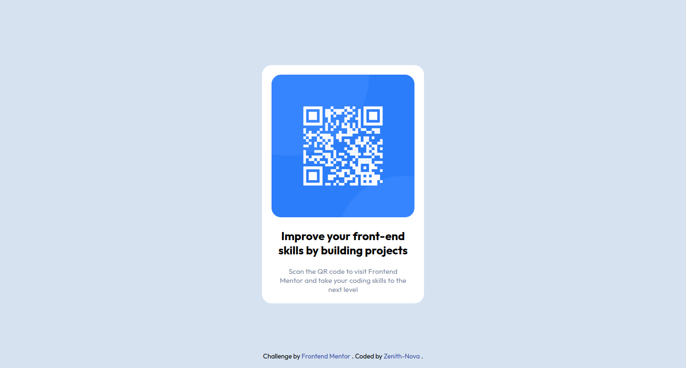

# Frontend Mentor - QR code component solution

This is a solution to the [QR code component challenge on Frontend Mentor](https://www.frontendmentor.io/challenges/qr-code-component-iux_sIO_H). Frontend Mentor challenges help you improve your coding skills by building realistic projects.

## Table of contents

- [Frontend Mentor - QR code component solution](#frontend-mentor---qr-code-component-solution)
  - [Table of contents](#table-of-contents)
  - [Overview](#overview)
    - [The challenge](#the-challenge)
    - [Screenshot](#screenshot)
    - [Links](#links)
  - [My process](#my-process)
    - [Built with](#built-with)
    - [What I learned](#what-i-learned)
      - [Semantic HTML5 Markup](#semantic-html5-markup)
      - [CSS Custom Properties](#css-custom-properties)
      - [Flexbox](#flexbox)
      - [CSS Grid](#css-grid)
      - [Mobile-First Workflow](#mobile-first-workflow)
    - [Continued development](#continued-development)
      - [Continuous Learning](#continuous-learning)
    - [Useful resources](#useful-resources)
  - [Author](#author)

## Overview

### The challenge

Users should be able to:

- See hover and focus states for all interactive elements on the page

### Screenshot


[screen-shots]()

### Links

- Solution URL: [Add solution URL here](https://your-solution-url.com)
- Live Site URL: [Add live site URL here](https://your-live-site-url.com)

## My process

### Built with

- Semantic HTML5 markup
- CSS custom properties
- Flexbox
- CSS Grid
- Mobile-first workflow

### What I learned

In the course of this project, I gained valuable insights and skills that significantly contributed to my growth as a developer. Here's a summary of my major learnings:

#### Semantic HTML5 Markup

Understanding the importance of semantic HTML5 markup laid a solid foundation for future development. By structuring content in a meaningful way.

#### CSS Custom Properties

Leveraging CSS custom properties provided me with a powerful tool for maintaining and organizing my styles. It allowed for easy updates across the entire project and improved overall code maintainability.

```css
:root {
	/* colors */
	/* primary */
	--clr-yellow: hsl(47, 88%, 63%);
	/* neutral */
	--clr-white: hsl(0, 0%, 100%);
	--clr-grey: hsl(0, 0%, 50%);
	--clr-black: hsl(0, 0%, 7%);
	/* font */
	--p-font: 16px;
}
```

#### Flexbox

Implementing Flexbox was instrumental in creating responsive and flexible layouts. It simplified the positioning of elements, making it easier to achieve a consistent design across various screen sizes.

```css
.container {
	background: var(--clr-white);
	border-radius: 20px;
	/* flex box*/
	display: flex;
	justify-content: center;
	align-items: center;
	flex-direction: column;

	width: 80%;
	max-width: 400px;
	height: 500px;
	position: relative;
	outline: 2px solid var(--clr-grey);
	box-shadow: 10px 10px 0 2px var(--clr-black);
}
```

#### CSS Grid

Mastering CSS Grid provided me with a powerful tool for creating complex, grid-based layouts. It improved the overall structure of my project and facilitated the alignment of elements in a visually appealing manner.

```css
.container .content {
	border-radius: 20px;
	height: 100%;
	display: grid;
	margin: 20px;
}
```

#### Mobile-First Workflow

Adopting a mobile-first workflow was key to ensuring a seamless user experience across different devices. Starting with a mobile design and progressively enhancing it for larger screens improved performance and accessibility.

```css
/* Example of Mobile-First Media Query */
@media screen and (min-width: 375px) {
	.content > p {
		font-size: 1px;
	}
}
```

By reflecting on these key learnings and incorporating them into my workflow, I've not only enhanced the current project but also strengthened my foundation as a web developer.

### Continued development

While completing this project has been a valuable learning experience, there are specific areas that I intend to focus on for continuous improvement in future projects:

1. Responsive Design

   Enhancing my skills in creating even more responsive and adaptive designs will be a priority. Exploring advanced techniques, such as CSS layouts, media queries and viewport units, will allow me to cater to a wider range of devices and screen sizes effectively.

2. Version Control (Git)

   Furthering my understanding of version control with Git and GitHub will contribute to better project management and collaboration. Mastering branching strategies, pull requests, and effective use of Git in a team environment are areas I aim to strengthen.

3. Hosting

#### Continuous Learning

Staying abreast of the latest web technologies and best practices is essential. Engaging with the developer community, participating in online forums, and exploring new frameworks or libraries will keep me informed and adaptable in a rapidly evolving landscape.

By concentrating on these areas of development, I aim to not only refine my existing skills but also embrace new challenges and technologies for creating innovative and user-friendly web projects.

### Useful resources

During this project, I relied on various resources that significantly contributed to my learning and development.

1. General Web Development:

   1. [Mozilla Developer Network (MDN)](https://developer.mozilla.org/): MDN is a comprehensive resource with documentation on HTML, CSS, and JavaScript. It also provides guides on web development concepts.

   2. [W3Schools](https://www.w3schools.com/): W3Schools offers tutorials and references on web development technologies, including HTML, CSS, JavaScript, and various web frameworks.

   3. [freeCodeCamp](https://www.freecodecamp.org/): freeCodeCamp provides interactive coding challenges and certifications covering HTML, CSS, JavaScript, Node.js, and more.

2. Front-End Development:

   1. [CSS-Tricks](https://css-tricks.com/): A website with tips, tricks, and tutorials on CSS. It covers a wide range of topics from basics to advanced techniques.

   2. [A Complete Guide to Flexbox](https://css-tricks.com/snippets/css/a-guide-to-flexbox/): This CSS-Tricks guide is an excellent resource for mastering Flexbox layout.

   3. [A Complete Guide to Grid](https://css-tricks.com/snippets/css/complete-guide-grid/): Another CSS-Tricks guide focusing on mastering CSS Grid layout.

   4. [JavaScript.info](https://javascript.info/): A modern JavaScript tutorial covering the language from basics to advanced topics.

3. Version Control
   1. [Pro Git Book](https://git-scm.com/book/en/v2): The official Pro Git book is a great resource to learn about Git, a version control system.
   2. [GitBook](https://books.goalkicker.com/GitBook/)

## Author

- Website - [Gideon-Yebei](https://gideon-yebei.rf.gd)
- Frontend Mentor - [@Gideon-Yebei](https://www.frontendmentor.io/profile/Gideon-Yebei)
- Twitter - [@GideonYebei](https://www.twitter.com/GideonYebei)
